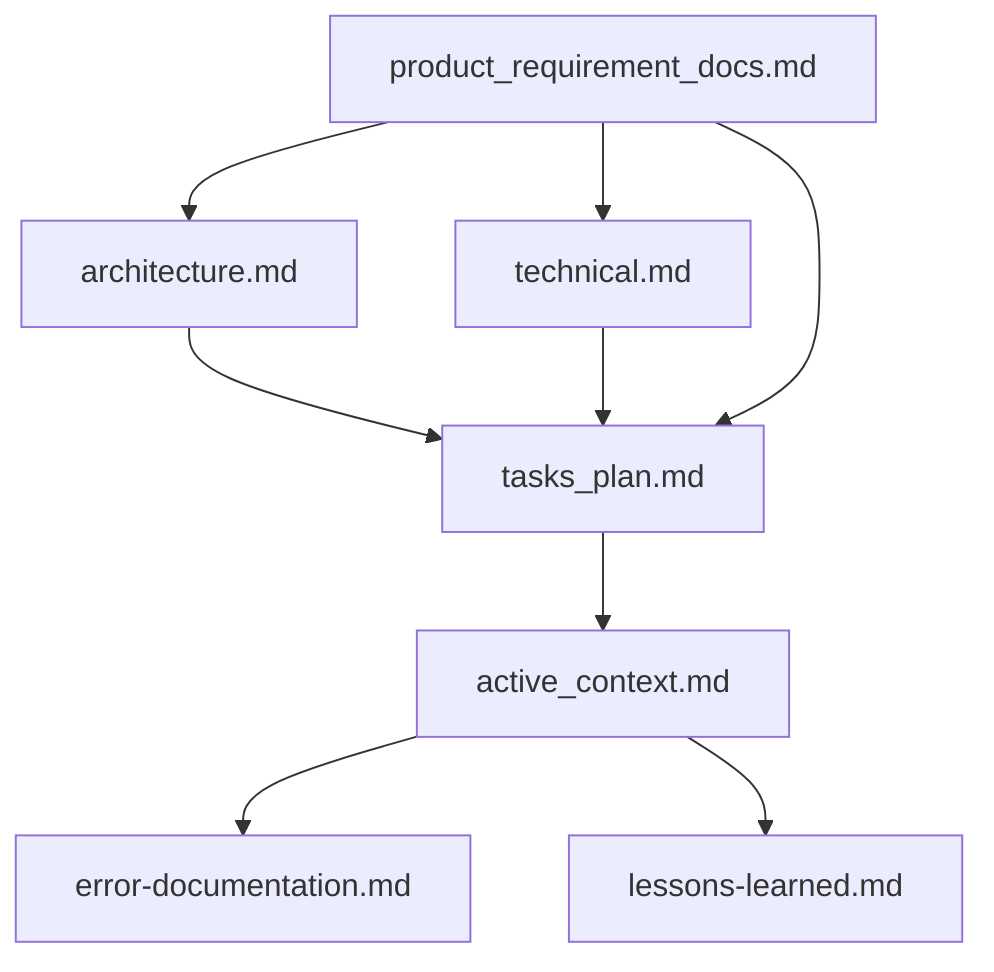

<!-- Generated by scripts/lib/render-codex-guidance.py. -->
<!-- Edit shared project guidance in CLAUDE.md; edit only codex-specific here. -->
<!-- fleet-base:begin v=2 -->
# AGENTS.md — Mimittos (`mimittos_project`)

Codex descubre estas instrucciones desde la raiz del repo. Las skills viven en `.agents/skills/`, los agentes especializados en `.codex/agents/`, y modelo, sandbox y aprobaciones se heredan de `~/.codex/config.toml`.

Esta seccion es la **base comun del fleet** y se sincroniza desde
`vps-ops-toolkit/workflows/.claude/base/CLAUDE.md.tmpl`. No editar manualmente:
los cambios se pierden en el proximo sync. Para customizar este proyecto, usar
el bloque `project-shared` mas abajo.

## Convencion de lenguaje

- Codigo, identificadores y nombres de variable: **ingles**.
- Mensajes de commit: **ingles** (Conventional Commits).
- Docs operativos, skills y reportes: **espanol** (terminos tecnicos en ingles donde son de uso corriente).
- Mensajes de error visibles al usuario final: idioma del proyecto.

<!-- session-start-protocol:begin -->
## Session Start Protocol

Al inicio de **cada sesión y antes de editar archivos**, debes invocar la skill `git-sync` para este repo. Razón: el operador trabaja desde múltiples máquinas y procesos automatizados (cron, CI) pueden haber commiteado cambios que tu copia local no tiene; editar sobre una versión desactualizada genera conflictos o trabajo duplicado.

**Flujo:**
1. Un hook `SessionStart` (definido en `~/.codex/hooks.json`) ejecuta `git fetch + git status` read-only y te inyecta el estado de este repo como contexto.
2. Si el reporte indica `behind > 0` o `dirty > 0`, **invoca la skill `git-sync`** antes de hacer cualquier cambio. `git-sync` hace rebase contra el parent branch y, si hay conflictos, te guía interactivamente por la resolución.
3. Si el reporte indica `behind=0 ahead=0 dirty=0`, el repo ya está sincronizado y puedes proceder.
4. Si `behind=0` y `dirty=0` pero `ahead>0` (commits locales sin pushear): podés proceder a editar; el push pendiente se resuelve durante la sesión (commit+push del flujo normal) — no requiere `git-sync`.

**Importante:** Nunca uses `git pull --force`, `git reset --hard` ni stash automático para "resolver" el sync — usa siempre la skill `git-sync`, que es segura y reproducible.
<!-- session-start-protocol:end -->

<!-- git-branch-protocol:begin -->
## Reglas de trabajo con Git: ramas, worktrees y commits (protocolo por sesión)

**Nunca hagas commits directamente sobre `main`/`master`, sobre una rama release, ni sobre la rama de OTRA sesión.**

**El modelo es 1 sesión = 1 rama = 1 worktree = 1 PR.** Cada sesión crea SU rama al arrancar trabajo, en SU git worktree, y abre el PR en el primer push con dueño e intención declarados. Está PROHIBIDO reutilizar la rama de otra sesión o acumular trabajo de varias tareas en una rama compartida — eso produce ramas con N dueños, archivos contaminados con hunks ajenos y merges imposibles de ordenar (medido en el fleet el 2026-08-16). El drenaje ordenado de vuelta a la base lo hace `$merge-queue` (varias ramas) o `$merge-when-green` (la tuya). Antes de cualquier `git commit`, seguí este protocolo:

### 0. (Fleet) Confirmá la coordenada: host + base de integración

Si este repo pertenece al fleet `vps-ops-toolkit` (existe `~/webapps/vps-ops-toolkit/projects.yml`), la **fuente de verdad de dónde se trabaja y sobre qué BASE se corta tu rama** es `projects.yml` validado contra los PRs abiertos:

```bash
OPS=~/webapps/vps-ops-toolkit
RESOLVER="$OPS/scripts/maintenance/resolve-work-coordinate.sh"
# OJO worktrees: el nombre del proyecto sale del git-common-dir (el clon
# principal) — en un worktree, el toplevel es ~/webapps/.wt/<repo>/<slug>.
PROJ=$(basename "$(dirname "$(git rev-parse --path-format=absolute --git-common-dir)")")
[[ -x "$RESOLVER" ]] && bash "$RESOLVER" --check "$PROJ"   # imprime vps_work, resolved_branch, pr_state, host_status, matches_yml
```

- **`host_status=wrong-host`** → **PARÁ**. El trabajo de este proyecto va en OTRO clon (el `vps_work` que imprime el resolver — p.ej. kore se trabaja en el clon de `vps-projectapp-staging`, no en el de producción). Avisá al operador antes de commitear acá.
- **`BASE` de tu rama de sesión**: con `pr_state=single` (repo con release activa) la base es **`resolved_branch`** — tu rama sale DE la release y tu PR apunta A la release (modelo stacked; la release mantiene su propio PR hacia `main`/`master`, gateado por `release_merge`). Con `prod-direct`/`no-pr`, la base es la default (`main`/`master`). **NUNCA hagas checkout de la release ni commitees en ella** — la release sólo recibe trabajo vía PRs de sesión.
- **`matches_yml=no`** (el candidato a release difiere del registrado, p.ej. la release anterior se mergeó y hay otra) → avisá al operador; puede que haya que refrescar `projects.yml` con `bash "$RESOLVER" --apply "$PROJ"` en el toolkit.
- **`branch_deploy_status=yml-stale`** (el clon acá ya está en la rama nueva y el `branch:` de projects.yml quedó viejo) → avisá y refrescá el yml con `bash "$RESOLVER" --fix "$PROJ"` (desde el toolkit). NUNCA hagas checkout de la rama vieja del yml sobre el clon. Si es `unbacked` o `server_status` marca host ajeno → derivar a `migrate-project` / revisión manual, sin auto.
- **Sin toolkit, o el proyecto no está en `projects.yml`** → base = `main`/`master` y seguí con la sección 1.

### 1. Dónde estás parado determina qué hacés

```bash
git rev-parse --show-toplevel
```

- **Bajo `~/webapps/.wt/<repo>/<slug>`** → estás en un worktree de sesión. Si la rama es TUYA (la creaste vos en esta sesión): commiteá (sección 8). Si es de otra sesión: no toques nada — creá el tuyo (sección 2).
- **En el clon principal (`~/webapps/<repo>`)** → **acá no se edita ni se commitea**. El checkout del clon principal es el del servicio/deploy y NO SE TOCA: ni `git checkout`, ni resets, ni borrar `node_modules`, ni stashes ajenos. Creá tu worktree (sección 2) y trabajá allá. (Excepción de sólo-lectura: `git status/log/diff/fetch` están bien en cualquier lado.)

### 2. Arrancando trabajo nuevo: SIEMPRE tu propia rama + worktree

No busques ramas abiertas para reutilizar — **cada sesión corta la suya** desde la BASE de la sección 0 (comandos exactos en la sección 5). Una rama de otra sesión nunca se reutiliza, ni "para un cambio chico"; la única excepción es un pedido explícito del operador. Si tu sesión YA tiene su rama/worktree de un turno anterior, seguí usándolos (tu trabajo en curso se acumula en TU rama).

### 3. Formato obligatorio del nombre de rama

`<prefijo>/<DDMMYYYY>-<descripcion-corta>`

- **`<prefijo>`** según el tipo de cambio:
  - `feat` — nueva funcionalidad
  - `fix` — corrección de bug
  - `docs` — cambios en documentación
  - `refactor` — refactorización sin cambio funcional
  - `test` — añadir o modificar tests
  - `chore` — mantenimiento (dependencias, configs)
  - `style` — formato/estilo, sin cambio de lógica
  - `perf` — mejoras de rendimiento
  - `ci` — cambios en workflows o pipelines
  - `hotfix` — corrección urgente en producción

- **`<DDMMYYYY>`** debe ser la fecha actual del sistema obtenida con `date +%d%m%Y`. Nunca la asumas ni la inventes.

- **`<descripcion-corta>`** en kebab-case, máximo 5 palabras, en inglés o español según el idioma del proyecto.

### 4. Ejemplos de nombres válidos

- `feat/15052026-login-google-oauth`
- `fix/15052026-typo-readme`
- `refactor/15052026-extract-user-service`
- `docs/15052026-update-deploy-guide`
- `chore/15052026-bump-django-version`

### 5. Comandos exactos a ejecutar

```bash
# 1. Fecha del día (no asumirla) + identidad del repo y la base (sección 0)
TODAY=$(date +%d%m%Y)
REPO=$(basename "$(dirname "$(git rev-parse --path-format=absolute --git-common-dir)")")
BASE=<base de integración de la sección 0>       # release si pr_state=single; main/master si no
SLUG=<descripcion-corta>

# 2. Crear TU rama en TU worktree (desde el clon principal ~/webapps/<repo>)
git fetch origin "$BASE" --quiet
git worktree add "$HOME/webapps/.wt/${REPO}/${SLUG}" -b <prefijo>/${TODAY}-${SLUG} "origin/${BASE}"
cd "$HOME/webapps/.wt/${REPO}/${SLUG}"

# 3. Guard: confirmar que estás bajo .wt/ ANTES de escribir
git rev-parse --show-toplevel   # debe caer bajo ~/webapps/.wt/ — si no, frená

# 4. Recién entonces hacer add y commit
git add <archivos>
git commit -m "<mensaje siguiendo conventional commits>"
```

- `npm ci` / instalar dependencias **dentro del worktree** sólo si tu tarea necesita frontend (build/tests). Jamás toques el `node_modules`, los refs o los stashes de otro tree.
- Al terminar la sesión, `$all-in-base` verifica el aterrizaje y retira el worktree; si quedó huérfano: `git worktree remove ~/webapps/.wt/<repo>/<slug>` (desde el clon principal) — nunca con `--force` si está sucio.

### 6. Inferencia del prefijo

Determina el prefijo a partir del contenido de los cambios:
- Archivos nuevos que añaden features → `feat`
- Cambios que arreglan comportamiento roto → `fix`
- Solo cambios en `*.md`, comentarios o JSDoc → `docs`
- Cambios en `package.json`, `requirements.txt`, configs → `chore`
- Cambios en `.github/workflows/*` → `ci`
- Archivos `*test*` / `*spec*` modificados o añadidos → `test`
- Reorganización sin alterar comportamiento → `refactor`

Si hay ambigüedad, pregunta al usuario una sola vez antes de crear la rama.

### 7. Excepciones

- Operaciones de solo lectura (`git status`, `git log`, `git diff`, `git fetch`) están permitidas en cualquier lado, incluido el clon principal.
- Si el usuario explícitamente pide quedarse en `main` para revisar algo sin commitear, respeta esa intención.
- Dentro de TU rama de sesión, los cambios de tu tarea se acumulan como commits sucesivos — no abras una segunda rama por "sub-cambio" de la MISMA tarea. Trabajo NUEVO no relacionado en la misma sesión: preguntale al operador si va como commit en tu rama o como rama de sesión nueva.
- **Convención: 1 sesión = 1 rama = 1 worktree = 1 PR; N PRs de sesión abiertos en paralelo son estado normal.** El límite duro es de RELEASES: máximo 1 PR de release (base=default) por repo, identificado por `branch_working` en projects.yml.
- Sincronizar tu rama: `$git-sync` — una rama pusheada con PR se sincroniza contra su propio upstream y absorbe la base movida con `git merge origin/<base>`, **nunca** con rebase (el force push está denegado en el fleet).

### 8. Mensajes de commit

Sigue Conventional Commits, con el mismo prefijo de la rama cuando aplique:

```
feat: add Google OAuth login flow
fix: correct typo in deployment README
refactor: extract user validation into service
```

### 9. PR al primer push (con dueño declarado) + reporte de la URL

En el **primer `git push -u origin <rama>`** de tu rama de sesión, abrí el PR ahí mismo — no lo dejes para después: el PR es lo que le da a tu rama dueño visible, intención declarada y CI corriendo desde temprano.

```bash
git push -u origin <rama>
gh pr create --base "<BASE de la sección 0>" --fill \
  --body "$(printf 'Sesión: %s\nIntención: %s\n\n%s' '<nombre de tu sesión (el título que le dio el operador), o el slug de la rama si no lo conocés>' '<1 línea: qué entrega esta rama>' '<resumen breve de los cambios>')"
```

- Las líneas `Sesión:` y `Intención:` del body son **contrato**: `$merge-queue` las usa para saber a quién delegarle conflictos y fixes. No las omitas.
- Termina tu respuesta con la URL, etiquetada `PR URL: <url>` (si `gh` no está disponible, la URL "Create a pull request" que imprime el push, y decí que el PR quedó pendiente de abrir).
- Pushes posteriores de la misma rama: reporta la URL del PR existente (`gh pr view --json url -q .url`).
- Si por excepción se commiteó directo a `main`/`master` (sólo posible en proyectos sin esta regla), declara explícitamente: "PR URL: n/a (push directo a `main`)".
- Si hubo cambios en varios proyectos en el mismo turno, entrega una **lista** con un `PR URL:` por proyecto.
<!-- git-branch-protocol:end -->

<!-- e2e-user-flows-protocol:begin -->
## E2E User Flows Check

Cuando termines de implementar un cambio que afecte un **flujo de usuario en el frontend** — por ejemplo:
- Crear o editar un formulario (agregar/quitar campos)
- Nueva ruta, página o vista accesible al usuario
- Cambios en flujos de autenticación, checkout, onboarding, búsqueda, perfil
- Modificaciones al registro de flows E2E (`frontend/e2e/flow-definitions.json`, o los shards por-flow + docs derivados en repos con `flow_definitions_dir`)

…debes invocar la skill `e2e-user-flows-check` como **paso final** antes de reportar la implementación como completa. Esa skill audita la cobertura E2E del flujo modificado y reporta brechas/riesgos.

**Por qué:** los flujos de usuario en frontend cambian las assumptions de los tests E2E. Sin auditoría, un campo eliminado deja tests "verdes" pero inválidos, y un form nuevo queda sin cobertura.

**No aplica para:** correcciones aisladas que no cambian el flujo (typos, refactors internos, estilos puros, dependency bumps), ni cambios solo en backend que no alteren UX.

**Recordatorio automático:** el protocolo de cierre de Codex revisa al cierre del turno si hay cambios uncommitted bajo `frontend/src/`, `frontend/app/`, etc., y te lo inyecta como contexto. El hook es un recordatorio, no bloqueante — la regla aplica igual aunque el hook no dispare.
<!-- e2e-user-flows-protocol:end -->

## Ecosistemas IA paralelos

Este proyecto tiene dos ecosistemas activos en paralelo: Claude Code (`CLAUDE.md` + `.claude/`) y Codex (`AGENTS.md` + `.agents/skills/` + `.codex/config.toml`).
Ambos comparten el
mismo cuerpo de instrucciones general; el frontmatter y la estructura cambian
por ecosistema. La fuente de verdad es `vps-ops-toolkit/workflows/`.
<!-- fleet-base:end -->

<!-- project-shared:begin source=CLAUDE.md -->
# MIMITTOS — Claude Code Configuration

## Project Identity

- **Name**: MIMITTOS — Más que un peluche, un recuerdo
- **Domain**: E-commerce de peluches artesanales hechos a mano en Colombia, personalizados para el cliente.
- **Stack**: Django 5 + DRF (backend) / Next.js 16 App Router + React + TypeScript (frontend) / MySQL 8 (dev y prod) / Redis / Huey
- **Payment gateway**: Wompi (Colombia) — webhook-based, no polling
- **Status**: En desarrollo activo. Frontend y backend integrados en feature branch.

---

## Dev Commands

### Backend

> **Base de datos**: `manage.py` usa `base_feature_project.settings_dev` por defecto, que hereda la BD de `settings.py` → MySQL (`mimittos_project_db`, configurada en `.env`). Es la **misma BD que prod**, así que `runserver` ve los productos creados desde el admin. Requiere MySQL corriendo localmente. Para una BD SQLite aislada de scratch: `DJANGO_DB_ENGINE=django.db.backends.sqlite3` en `.env`.

```bash
cd backend && source venv/bin/activate

# Start server
python manage.py runserver 0.0.0.0:8000

# Migrations
python manage.py makemigrations && python manage.py migrate

# Seed everything (primera vez o acumulativo)
python manage.py seed_all

# Seed con imágenes reales de Unsplash (requiere internet)
python manage.py seed_all

# Seed rápido sin descargas ni analytics
python manage.py seed_all --skip-featured --skip-analytics --skip-color-images

# Resetear peluches/órdenes y re-sembrar
python manage.py seed_all --reset

# Comandos individuales disponibles:
python manage.py seed_demo          # categorías, colores, tallas, 4 peluches, usuario demo, 3 órdenes
python manage.py seed_featured      # imágenes Unsplash para categorías + 4 peluches destacados
python manage.py seed_analytics     # 30 días de analytics falsos
python manage.py seed_color_images  # imágenes placeholder por peluch+color
python manage.py seed_all           # todos los anteriores en orden

# Demo user: demo@mimittos.com / Demo1234!
```

### Frontend

```bash
cd frontend
npm run dev        # http://localhost:3000
npm run build
npm run lint
```

---

## Directory Structure

```
mimittos_project/
├── backend/
│   ├── base_feature_app/          # única Django app — modelos, vistas, servicios
│   │   ├── models/                # un archivo por modelo
│   │   ├── views/                 # vistas FBV organizadas por dominio
│   │   ├── services/              # lógica de negocio (catalog, order, payment, content)
│   │   ├── serializers/
│   │   ├── management/commands/   # seed_all, seed_demo, seed_featured, etc.
│   │   ├── migrations/
│   │   └── tests/
│   ├── base_feature_project/      # configuración Django (settings, urls, wsgi)
│   └── venv/
└── frontend/
    ├── app/                       # Next.js App Router
    │   ├── (public)/              # rutas públicas con PublicChrome layout
    │   ├── backoffice/            # panel admin
    │   └── globals.css
    ├── components/
    │   ├── layout/                # PublicChrome, Header, Footer, PromoBanner
    │   ├── ui/                    # PageCurtain, componentes reutilizables
    │   └── admin/                 # AdminSidebar, componentes backoffice
    └── lib/
        ├── stores/                # Zustand: authStore, cartStore
        └── services/              # http.ts (axios), contentService, etc.
```

---

## General Rules

These should be respected ALWAYS:
1. Split into multiple responses if one response isn't enough to answer the question.
2. IMPROVEMENTS and FURTHER PROGRESSIONS:
   - S1: Suggest ways to improve code stability or scalability.
   - S2: Offer strategies to enhance performance or security.
   - S3: Recommend methods for improving readability or maintainability.
   - Recommend areas for further investigation

---

## Security Rules — OWASP / Secrets / Input Validation

### Secrets and Environment Variables

NEVER hardcode secrets. Always use environment variables.

```python
# ✅ Django — use env vars
import os
from dotenv import load_dotenv

load_dotenv()

SECRET_KEY = os.environ['DJANGO_SECRET_KEY']
DATABASE_URL = os.environ['DATABASE_URL']
WOMPI_PRIVATE_KEY = os.environ['WOMPI_PRIVATE_KEY']

# ❌ NEVER do this
SECRET_KEY = 'django-insecure-abc123xyz'
```

```typescript
// ✅ Next.js — use env vars
const apiUrl = process.env.NEXT_PUBLIC_API_URL

// ❌ NEVER do this
const API_KEY = 'sk-live-abc123xyz'
```

### .env rules

- `.env` files MUST be in `.gitignore`. Always verify before committing
- Use `.env.example` with placeholder values for documentation
- In Next.js: only `NEXT_PUBLIC_*` vars are exposed to the browser

### Input Validation — Django/DRF

```python
# ✅ Serializer validates input
class OrderSerializer(serializers.Serializer):
    email = serializers.EmailField()
    quantity = serializers.IntegerField(min_value=1, max_value=100)
```

### SQL Injection Prevention

```python
# ✅ Django ORM — always safe
users = User.objects.filter(email=user_input)

# ❌ NEVER interpolate user input into SQL
cursor.execute(f"SELECT * FROM users WHERE email = '{user_input}'")
```

### XSS Prevention

```typescript
// ✅ React auto-escapes by default
return <p>{userInput}</p>

// ❌ NEVER use dangerouslySetInnerHTML with user input
return <div dangerouslySetInnerHTML={{ __html: userInput }} />
```

### CSRF Protection

```python
# ✅ CSRF middleware — NEVER remove
MIDDLEWARE = ['django.middleware.csrf.CsrfViewMiddleware', ...]
```

### Security Checklist — Before Every Deployment

- [ ] No secrets in code or git history
- [ ] `.env` is in `.gitignore`
- [ ] All user input is validated (server + client)
- [ ] No raw SQL with user input
- [ ] CSRF protection enabled
- [ ] Authentication required on all sensitive endpoints
- [ ] Serializers exclude sensitive fields
- [ ] `pip audit` / `npm audit` clean
- [ ] File uploads validated
- [ ] DEBUG = False in production

---

## Memory Bank System

This project uses a Memory Bank system to maintain context across sessions. The core files are:



### Core Files (Required)

| # | File | Purpose |
|---|------|---------|
| 1 | `docs/methodology/product_requirement_docs.md` | PRD: por qué existe este proyecto, requerimientos, alcance |
| 2 | `docs/methodology/architecture.md` | Arquitectura del sistema, diagramas Mermaid |
| 3 | `docs/methodology/technical.md` | Stack, setup, patrones técnicos, restricciones |
| 4 | `tasks/tasks_plan.md` | Backlog, progreso, problemas conocidos |
| 5 | `tasks/active_context.md` | Foco actual, cambios recientes, próximos pasos |
| 6 | `docs/methodology/error-documentation.md` | Errores conocidos y sus resoluciones |
| 7 | `docs/methodology/lessons-learned.md` | Inteligencia del proyecto, patrones, preferencias |

### When to Update Memory Files

1. After discovering new project patterns
2. After implementing significant changes
3. When the user requests with **update memory files** (review ALL core files)
4. After a significant part of a plan is verified

---

## Testing Rules

### Execution Constraints

- **Never run the full test suite** — always specify files
- **Maximum per execution**: 20 tests per batch, 3 commands per cycle
- **Backend**: Always activate venv first: `source venv/bin/activate && pytest path/to/test_file.py -v`
- **Frontend unit**: `npm test -- path/to/file.spec.ts`
- **E2E**: max 2 files per `npx playwright test` invocation
- Use `E2E_REUSE_SERVER=1` when dev server is already running

### Quality Standards

- Each test verifies **ONE specific behavior**
- **No conjunctions** in test names — split into separate tests
- Assert **observable outcomes** (status codes, DB state, rendered UI)
- **No conditionals** in test body — use parameterization
- Follow **AAA pattern**: Arrange → Act → Assert
- Mock only at **system boundaries** (external APIs, clock, email)

---

## Lessons Learned — MIMITTOS

### Architecture Patterns

#### Single Django App: `base_feature_app`
- Todos los modelos, vistas, servicios y serializers viven en `base_feature_app`
- Los modelos están divididos en archivos individuales bajo `base_feature_app/models/`
- NO existe una app `content/` — el nombre del cascarón era diferente

#### Service Layer Pattern
- La lógica de negocio vive en `base_feature_app/services/`, NO en las vistas
- Las vistas son wrappers FBV delgados que llaman métodos de servicio
- Servicios principales: `catalog_service`, `order_service`, `payment_service`, `content_service`

#### SiteContent — JSON configurable desde admin
- Modelo `SiteContent` con `key` (TextChoices) y `content_json` (JSONField)
- Keys actuales: `promo_banner`, `hero_image`
- El frontend lee `/content/<key>/` y renderiza según el JSON
- Seedeado en `seed_all` → Step 5

#### Content Storage: Structured JSON
- Contenido configurable almacenado como JSON en `SiteContent.content_json`
- No hay CMS ni sistema de plantillas de email propio — correos via SMTP directo

### Modelos clave

#### Peluch
- `badge`: `none | bestseller | new | limited_edition`
- Personalizaciones opcionales: `has_huella`, `has_corazon`, `has_audio` (con `extra_cost` cada uno)
- Config por talla via `PeluchSizePrice` (FK a `GlobalSize`): `price`, `is_available`, `deposit_percentage` (% anticipo contraentrega), `full_payment_discount_pct` (% descuento si paga todo), `free_shipping`, `shipping_cost`. El `discount_pct` general sigue a nivel `Peluch`.
- Colores via M2M `available_colors` → `GlobalColor`
- Imágenes via `django-attachments` Library/Attachment
- Imágenes por color via `PeluchColorImage` (generadas con `seed_color_images`)

#### Order
- Flujo de estados: `pending_payment → payment_confirmed → in_production → shipped → delivered`
- `total_amount` = suma de items; `deposit_amount` = 50% (calculado por `OrderService.calculate_deposit`)
- Cada cambio de estado se registra en `OrderStatusHistory`
- Un `WompiTransaction` por orden (puede ser `PENDING` → `APPROVED`)

### Pago — Wompi

- **Webhook es la fuente de verdad** — NO hacer polling al API de Wompi
- Flujo: crear `WompiTransaction` con `status=PENDING` → redirigir a checkout → webhook actualiza a `APPROVED`
- El frontend solo verifica el estado UNA VEZ cuando el usuario regresa del checkout (no loop)
- Wompi NO soporta códigos de descuento (verificado)

### Frontend — Layout público

- `PublicChrome` gestiona `bannerActive` state y pasa `bannerHeight` al `Header`
- `PromoBanner` llama `onLoad(true/false)` tras la respuesta de la API
- `Header` recibe `bannerHeight` prop para su `top` CSS (se desplaza debajo del banner)
- `PageCurtain` (GSAP): cortina coral con "MIMITTOS®" centrado, `overflow: hidden` obligatorio

### Frontend — Estilos

- Variables CSS en `globals.css`: `--coral`, `--navy`, `--cream-peach`, `--gray-warm`, etc.
- Fuentes: `Quicksand` (headings/brand) + `Nunito` (body)
- El ticker del promo banner usa `@keyframes ticker` con `-50% translateX` y texto duplicado
- Responsive: Tailwind `px-4 sm:px-8 lg:px-10`, mobile-first siempre

### Seed Commands

| Comando | Qué hace | Destructivo |
|---------|----------|-------------|
| `seed_all` | Orquesta todos los seeders en orden | No (salvo `--reset`) |
| `seed_featured` | Categorías + peluches con imágenes Unsplash | No |
| `seed_demo` | Demo user + 3 órdenes + peluches básicos | No (salvo `--reset`) |
| `seed_analytics` | 30 días de analytics falsos | No |
| `seed_color_images` | Imágenes placeholder por peluch+color | No |
| `seed_peluches` | ⚠️ BORRA todo y re-crea productos | **Sí** — no incluir en flujos automatizados |
| `create_fake_data` | Faker: usuarios, blogs, peluches, órdenes masivas | No |

---

## Error Documentation — MIMITTOS

### Catalog 500 — `no such column: base_feature_app_category.image`
- **Causa**: El servidor Django arrancó antes de aplicar la migración `0009`
- **Solución**: `python manage.py migrate` y reiniciar el servidor
- **Estado**: Resuelto

### URL conflict — `/content/hero-image/upload/` vs `/content/<str:key>/`
- **Causa**: La ruta dinámica capturaba la específica si se declaraba después
- **Solución**: Declarar la ruta específica ANTES de la dinámica en `urls/content.py`
- **Estado**: Resuelto

### Mobile horizontal overflow
- **Causa**: `whiteSpace: nowrap` en PageCurtain sin `overflow: hidden` en el contenedor + falta de `overflow-x: hidden` en body
- **Solución**: Agregar `overflow: hidden` al div contenedor de PageCurtain y `overflow-x: hidden` en `html, body` en `globals.css`
- **Estado**: Resuelto

---

## Methodology Maintenance

- Memory Bank basado en [rules_template](https://github.com/Bhartendu-Kumar/rules_template)
- Actualizar `tasks/active_context.md` y `tasks/tasks_plan.md` tras cambios significativos
- Actualizar `docs/methodology/architecture.md` cuando cambien flujos o componentes clave
<!-- project-shared:end -->

<!-- codex-specific:begin -->
## Ajustes exclusivos de Codex

No hay overrides exclusivos. Las reglas del proyecto viven en el bloque `project-shared`, cuya fuente canonica es `CLAUDE.md`.
<!-- codex-specific:end -->
