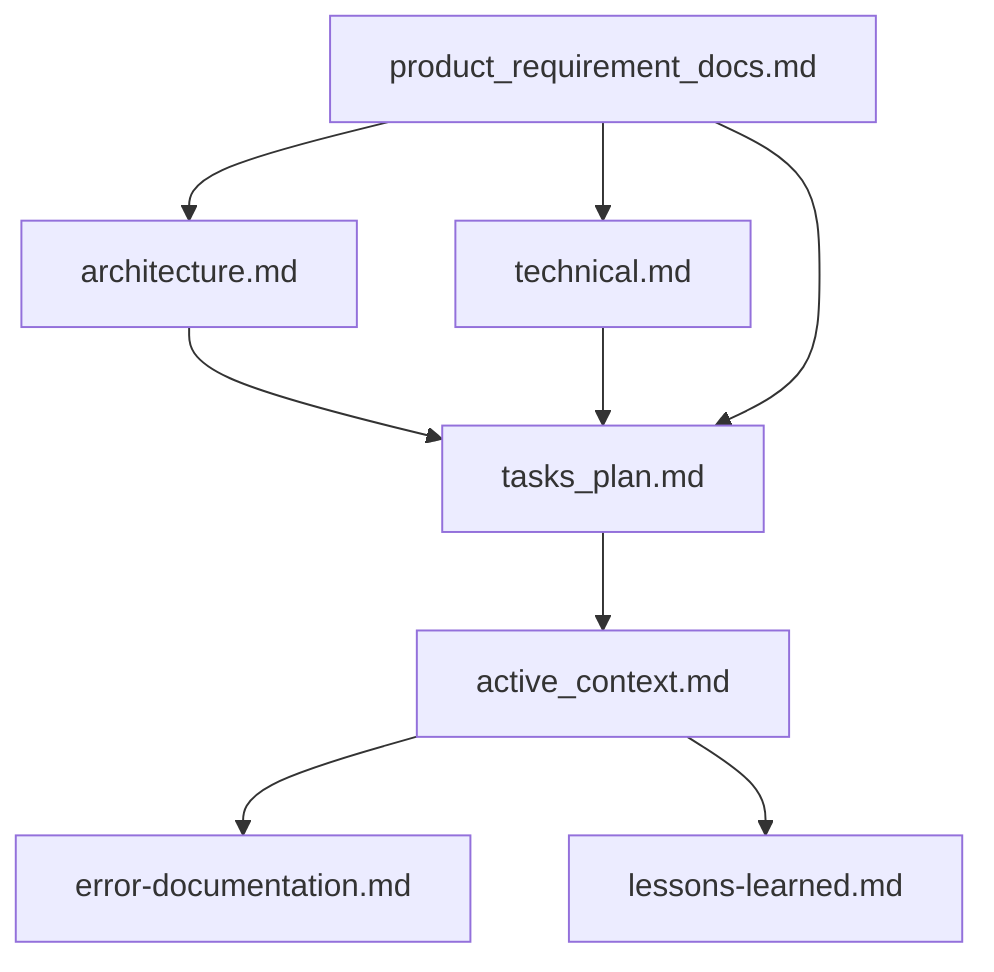

# MIMITTOS — Claude Code Configuration

## Project Identity

- **Name**: MIMITTOS — Más que un peluche, un recuerdo
- **Domain**: E-commerce de peluches artesanales hechos a mano en Colombia, personalizados para el cliente.
- **Stack**: Django 5 + DRF (backend) / Next.js 16 App Router + React + TypeScript (frontend) / MySQL 8 (dev y prod) / Redis / Huey
- **Payment gateway**: Wompi (Colombia) — webhook-based, no polling
- **Status**: En desarrollo activo. Frontend y backend integrados en feature branch.

---

## Dev Commands

### Backend

> **Base de datos**: `manage.py` usa `base_feature_project.settings_dev` por defecto, que hereda la BD de `settings.py` → MySQL (`mimittos_project_db`, configurada en `.env`). Es la **misma BD que prod**, así que `runserver` ve los productos creados desde el admin. Requiere MySQL corriendo localmente. Para una BD SQLite aislada de scratch: `DJANGO_DB_ENGINE=django.db.backends.sqlite3` en `.env`.

```bash
cd backend && source venv/bin/activate

# Start server
python manage.py runserver 0.0.0.0:8000

# Migrations
python manage.py makemigrations && python manage.py migrate

# Seed everything (primera vez o acumulativo)
python manage.py seed_all

# Seed con imágenes reales de Unsplash (requiere internet)
python manage.py seed_all

# Seed rápido sin descargas ni analytics
python manage.py seed_all --skip-featured --skip-analytics --skip-color-images

# Resetear peluches/órdenes y re-sembrar
python manage.py seed_all --reset

# Comandos individuales disponibles:
python manage.py seed_demo          # categorías, colores, tallas, 4 peluches, usuario demo, 3 órdenes
python manage.py seed_featured      # imágenes Unsplash para categorías + 4 peluches destacados
python manage.py seed_analytics     # 30 días de analytics falsos
python manage.py seed_color_images  # imágenes placeholder por peluch+color
python manage.py seed_all           # todos los anteriores en orden

# Demo user: demo@mimittos.com / Demo1234!
```

### Frontend

```bash
cd frontend
npm run dev        # http://localhost:3000
npm run build
npm run lint
```

---

## Directory Structure

```
mimittos_project/
├── backend/
│   ├── base_feature_app/          # única Django app — modelos, vistas, servicios
│   │   ├── models/                # un archivo por modelo
│   │   ├── views/                 # vistas FBV organizadas por dominio
│   │   ├── services/              # lógica de negocio (catalog, order, payment, content)
│   │   ├── serializers/
│   │   ├── management/commands/   # seed_all, seed_demo, seed_featured, etc.
│   │   ├── migrations/
│   │   └── tests/
│   ├── base_feature_project/      # configuración Django (settings, urls, wsgi)
│   └── venv/
└── frontend/
    ├── app/                       # Next.js App Router
    │   ├── (public)/              # rutas públicas con PublicChrome layout
    │   ├── backoffice/            # panel admin
    │   └── globals.css
    ├── components/
    │   ├── layout/                # PublicChrome, Header, Footer, PromoBanner
    │   ├── ui/                    # PageCurtain, componentes reutilizables
    │   └── admin/                 # AdminSidebar, componentes backoffice
    └── lib/
        ├── stores/                # Zustand: authStore, cartStore
        └── services/              # http.ts (axios), contentService, etc.
```

---

## General Rules

These should be respected ALWAYS:
1. Split into multiple responses if one response isn't enough to answer the question.
2. IMPROVEMENTS and FURTHER PROGRESSIONS:
   - S1: Suggest ways to improve code stability or scalability.
   - S2: Offer strategies to enhance performance or security.
   - S3: Recommend methods for improving readability or maintainability.
   - Recommend areas for further investigation

---

## Security Rules — OWASP / Secrets / Input Validation

### Secrets and Environment Variables

NEVER hardcode secrets. Always use environment variables.

```python
# ✅ Django — use env vars
import os
from dotenv import load_dotenv

load_dotenv()

SECRET_KEY = os.environ['DJANGO_SECRET_KEY']
DATABASE_URL = os.environ['DATABASE_URL']
WOMPI_PRIVATE_KEY = os.environ['WOMPI_PRIVATE_KEY']

# ❌ NEVER do this
SECRET_KEY = 'django-insecure-abc123xyz'
```

```typescript
// ✅ Next.js — use env vars
const apiUrl = process.env.NEXT_PUBLIC_API_URL

// ❌ NEVER do this
const API_KEY = 'sk-live-abc123xyz'
```

### .env rules

- `.env` files MUST be in `.gitignore`. Always verify before committing
- Use `.env.example` with placeholder values for documentation
- In Next.js: only `NEXT_PUBLIC_*` vars are exposed to the browser

### Input Validation — Django/DRF

```python
# ✅ Serializer validates input
class OrderSerializer(serializers.Serializer):
    email = serializers.EmailField()
    quantity = serializers.IntegerField(min_value=1, max_value=100)
```

### SQL Injection Prevention

```python
# ✅ Django ORM — always safe
users = User.objects.filter(email=user_input)

# ❌ NEVER interpolate user input into SQL
cursor.execute(f"SELECT * FROM users WHERE email = '{user_input}'")
```

### XSS Prevention

```typescript
// ✅ React auto-escapes by default
return <p>{userInput}</p>

// ❌ NEVER use dangerouslySetInnerHTML with user input
return <div dangerouslySetInnerHTML={{ __html: userInput }} />
```

### CSRF Protection

```python
# ✅ CSRF middleware — NEVER remove
MIDDLEWARE = ['django.middleware.csrf.CsrfViewMiddleware', ...]
```

### Security Checklist — Before Every Deployment

- [ ] No secrets in code or git history
- [ ] `.env` is in `.gitignore`
- [ ] All user input is validated (server + client)
- [ ] No raw SQL with user input
- [ ] CSRF protection enabled
- [ ] Authentication required on all sensitive endpoints
- [ ] Serializers exclude sensitive fields
- [ ] `pip audit` / `npm audit` clean
- [ ] File uploads validated
- [ ] DEBUG = False in production

---

## Memory Bank System

This project uses a Memory Bank system to maintain context across sessions. The core files are:



### Core Files (Required)

| # | File | Purpose |
|---|------|---------|
| 1 | `docs/methodology/product_requirement_docs.md` | PRD: por qué existe este proyecto, requerimientos, alcance |
| 2 | `docs/methodology/architecture.md` | Arquitectura del sistema, diagramas Mermaid |
| 3 | `docs/methodology/technical.md` | Stack, setup, patrones técnicos, restricciones |
| 4 | `tasks/tasks_plan.md` | Backlog, progreso, problemas conocidos |
| 5 | `tasks/active_context.md` | Foco actual, cambios recientes, próximos pasos |
| 6 | `docs/methodology/error-documentation.md` | Errores conocidos y sus resoluciones |
| 7 | `docs/methodology/lessons-learned.md` | Inteligencia del proyecto, patrones, preferencias |

### When to Update Memory Files

1. After discovering new project patterns
2. After implementing significant changes
3. When the user requests with **update memory files** (review ALL core files)
4. After a significant part of a plan is verified

---

## Testing Rules

### Execution Constraints

- **Never run the full test suite** — always specify files
- **Maximum per execution**: 20 tests per batch, 3 commands per cycle
- **Backend**: Always activate venv first: `source venv/bin/activate && pytest path/to/test_file.py -v`
- **Frontend unit**: `npm test -- path/to/file.spec.ts`
- **E2E**: max 2 files per `npx playwright test` invocation
- Use `E2E_REUSE_SERVER=1` when dev server is already running

### Quality Standards

- Each test verifies **ONE specific behavior**
- **No conjunctions** in test names — split into separate tests
- Assert **observable outcomes** (status codes, DB state, rendered UI)
- **No conditionals** in test body — use parameterization
- Follow **AAA pattern**: Arrange → Act → Assert
- Mock only at **system boundaries** (external APIs, clock, email)

---

## Lessons Learned — MIMITTOS

### Architecture Patterns

#### Single Django App: `base_feature_app`
- Todos los modelos, vistas, servicios y serializers viven en `base_feature_app`
- Los modelos están divididos en archivos individuales bajo `base_feature_app/models/`
- NO existe una app `content/` — el nombre del cascarón era diferente

#### Service Layer Pattern
- La lógica de negocio vive en `base_feature_app/services/`, NO en las vistas
- Las vistas son wrappers FBV delgados que llaman métodos de servicio
- Servicios principales: `catalog_service`, `order_service`, `payment_service`, `content_service`

#### SiteContent — JSON configurable desde admin
- Modelo `SiteContent` con `key` (TextChoices) y `content_json` (JSONField)
- Keys actuales: `promo_banner`, `hero_image`
- El frontend lee `/content/<key>/` y renderiza según el JSON
- Seedeado en `seed_all` → Step 5

#### Content Storage: Structured JSON
- Contenido configurable almacenado como JSON en `SiteContent.content_json`
- No hay CMS ni sistema de plantillas de email propio — correos via SMTP directo

### Modelos clave

#### Peluch
- `badge`: `none | bestseller | new | limited_edition`
- Personalizaciones opcionales: `has_huella`, `has_corazon`, `has_audio` (con `extra_cost` cada uno)
- Config por talla via `PeluchSizePrice` (FK a `GlobalSize`): `price`, `is_available`, `deposit_percentage` (% anticipo contraentrega), `full_payment_discount_pct` (% descuento si paga todo), `free_shipping`, `shipping_cost`. El `discount_pct` general sigue a nivel `Peluch`.
- Colores via M2M `available_colors` → `GlobalColor`
- Imágenes via `django-attachments` Library/Attachment
- Imágenes por color via `PeluchColorImage` (generadas con `seed_color_images`)

#### Order
- Flujo de estados: `pending_payment → payment_confirmed → in_production → shipped → delivered`
- `total_amount` = suma de items; `deposit_amount` = 50% (calculado por `OrderService.calculate_deposit`)
- Cada cambio de estado se registra en `OrderStatusHistory`
- Un `WompiTransaction` por orden (puede ser `PENDING` → `APPROVED`)

### Pago — Wompi

- **Webhook es la fuente de verdad** — NO hacer polling al API de Wompi
- Flujo: crear `WompiTransaction` con `status=PENDING` → redirigir a checkout → webhook actualiza a `APPROVED`
- El frontend solo verifica el estado UNA VEZ cuando el usuario regresa del checkout (no loop)
- Wompi NO soporta códigos de descuento (verificado)

### Frontend — Layout público

- `PublicChrome` gestiona `bannerActive` state y pasa `bannerHeight` al `Header`
- `PromoBanner` llama `onLoad(true/false)` tras la respuesta de la API
- `Header` recibe `bannerHeight` prop para su `top` CSS (se desplaza debajo del banner)
- `PageCurtain` (GSAP): cortina coral con "MIMITTOS®" centrado, `overflow: hidden` obligatorio

### Frontend — Estilos

- Variables CSS en `globals.css`: `--coral`, `--navy`, `--cream-peach`, `--gray-warm`, etc.
- Fuentes: `Quicksand` (headings/brand) + `Nunito` (body)
- El ticker del promo banner usa `@keyframes ticker` con `-50% translateX` y texto duplicado
- Responsive: Tailwind `px-4 sm:px-8 lg:px-10`, mobile-first siempre

### Seed Commands

| Comando | Qué hace | Destructivo |
|---------|----------|-------------|
| `seed_all` | Orquesta todos los seeders en orden | No (salvo `--reset`) |
| `seed_featured` | Categorías + peluches con imágenes Unsplash | No |
| `seed_demo` | Demo user + 3 órdenes + peluches básicos | No (salvo `--reset`) |
| `seed_analytics` | 30 días de analytics falsos | No |
| `seed_color_images` | Imágenes placeholder por peluch+color | No |
| `seed_peluches` | ⚠️ BORRA todo y re-crea productos | **Sí** — no incluir en flujos automatizados |
| `create_fake_data` | Faker: usuarios, blogs, peluches, órdenes masivas | No |

---

## Error Documentation — MIMITTOS

### Catalog 500 — `no such column: base_feature_app_category.image`
- **Causa**: El servidor Django arrancó antes de aplicar la migración `0009`
- **Solución**: `python manage.py migrate` y reiniciar el servidor
- **Estado**: Resuelto

### URL conflict — `/content/hero-image/upload/` vs `/content/<str:key>/`
- **Causa**: La ruta dinámica capturaba la específica si se declaraba después
- **Solución**: Declarar la ruta específica ANTES de la dinámica en `urls/content.py`
- **Estado**: Resuelto

### Mobile horizontal overflow
- **Causa**: `whiteSpace: nowrap` en PageCurtain sin `overflow: hidden` en el contenedor + falta de `overflow-x: hidden` en body
- **Solución**: Agregar `overflow: hidden` al div contenedor de PageCurtain y `overflow-x: hidden` en `html, body` en `globals.css`
- **Estado**: Resuelto

---

## Methodology Maintenance

- Memory Bank basado en [rules_template](https://github.com/Bhartendu-Kumar/rules_template)
- Actualizar `tasks/active_context.md` y `tasks/tasks_plan.md` tras cambios significativos
- Actualizar `docs/methodology/architecture.md` cuando cambien flujos o componentes clave
