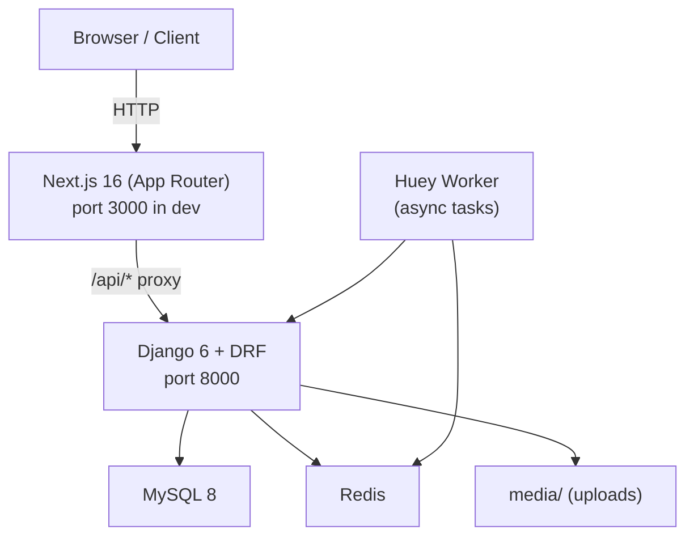

# Architecture — Mimittos

---

## 1. System Overview



In production, Django serves pre-rendered Next.js pages via a catch-all URL pattern; no separate Next.js process runs.

---

## 2. Django Application Structure

```
backend/
├── base_feature_app/          # Main app — all domain logic
│   ├── models/                # 19 model files (one per entity)
│   ├── serializers/           # 21 serializer files
│   ├── views/                 # 16 view files (all FBV with @api_view)
│   ├── services/              # 8 service modules (business logic)
│   ├── urls/                  # 13 URL routing modules
│   ├── tests/                 # 41 test files
│   ├── management/commands/   # 11 seed/fake data commands
│   ├── forms/
│   └── utils/
├── django_attachments/        # Reusable media attachment library
│   └── models.py              # Library, Attachment, TimestampModelMixin
├── base_feature_project/      # Django project
│   ├── settings.py
│   ├── urls.py                # Root URL conf; catch-all → Next.js pages
│   └── views.py               # Catch-all view (serves Next.js HTML)
└── conftest.py                # pytest fixtures (api_client, coverage report)
```

---

## 3. Model Relationships

```mermaid
erDiagram
    User ||--o{ Order : places
    User ||--o{ Review : writes
    User ||--o{ PageView : generates

    Peluch ||--o{ PeluchSizePrice : "has SKUs"
    Peluch ||--o{ PeluchColorImage : "has images"
    Peluch ||--o{ Review : "receives"
    Peluch ||--o{ OrderItem : "appears in"

    Category ||--o{ Peluch : categorizes
    GlobalColor ||--o{ PeluchColorImage : colors
    GlobalSize ||--o{ PeluchSizePrice : sizes

    Order ||--o{ OrderItem : contains
    Order ||--o{ OrderStatusHistory : tracks
    Order ||--|| WompiTransaction : pays_via
    Order ||--o{ PersonalizationMedia : attaches

    Sale ||--o{ SoldProduct : records
    SoldProduct }|--|| Product : references

    Blog ||-- SiteContent : ""
    PasswordCode }|--|| User : "belongs to"
```

**Key models** (19 files in `base_feature_app/models/`):
- `Peluch` — the product; slug-identified
- `PeluchSizePrice` — price per size variant
- `PeluchColorImage` — color gallery images
- `Order` — customer order with delivery info
- `OrderItem` — line item linking Order → Peluch + personalization
- `OrderStatusHistory` — audit trail of status changes
- `WompiTransaction` — Wompi payment record linked to Order
- `PersonalizationMedia` — audio/image uploads for customization
- `Review` — customer review on a Peluch
- `Category` — product category
- `GlobalColor` / `GlobalSize` — site-wide color/size presets
- `Product` — general product (distinct from Peluch)
- `Sale` / `SoldProduct` — promotional sales tracking
- `Blog` — blog post (bilingual JSON content)
- `SiteContent` — key-value dynamic site content
- `PageView` — analytics page view event
- `PasswordCode` — email-based password reset OTP
- `User` — custom user model with `UserManager`

---

## 4. Frontend Layer

```
frontend/
├── app/                       # Next.js App Router (26 routes)
│   ├── layout.tsx             # Root layout
│   ├── page.tsx               # Home (/)
│   ├── catalog/               # /catalog
│   ├── peluches/[slug]/       # /peluches/:slug (detail + personalization)
│   ├── cart/                  # /cart
│   ├── checkout/              # /checkout
│   ├── orders/                # /orders (auth required)
│   ├── tracking/              # /tracking (public)
│   ├── blogs/                 # /blogs, /blogs/[blogId]
│   ├── sign-in|sign-up|...    # Auth routes
│   └── backoffice/            # Staff-only admin area
├── components/                # 9 shared components
│   ├── admin/                 # AdminSidebar, PeluchForm
│   ├── blog/                  # BlogCard, BlogCarousel
│   ├── layout/                # Header, Footer, PublicChrome
│   └── product/               # ProductCard, ProductCarousel
└── lib/
    ├── stores/                # 5 Zustand stores
    ├── hooks/                 # 2 custom hooks
    ├── services/              # 13 API service modules + http.ts
    ├── i18n/                  # next-intl config
    └── types.ts               # Shared TypeScript types
```

### Request Flow

```
Browser
  → Next.js page component
    → Zustand store action
      → lib/services/<domain>Service.ts
        → lib/services/http.ts (Axios instance)
          → Django REST API
            → base_feature_app service layer
              → Django ORM → MySQL
```

### Auth Flow

```
Sign in → POST /api/sign_in/ → { access, refresh }
  → store in cookies (js-cookie)
  → Axios interceptor attaches Authorization header
  → On 401: POST /api/token/refresh/ → new access token
  → On refresh failure: clear cookies, redirect to home
```

---

## 5. API Surface (~58 endpoints across 13 modules)

| Module | Key Endpoints |
|--------|--------------|
| auth | sign_up, sign_in, google_login, verify_registration, send/verify passcode, update_password |
| catalog | sizes, colors, categories, peluches, featured, gallery, color-images |
| orders | create, list, my-orders, track, detail, status |
| payment | wompi webhook, status, process, check, PSE banks |
| reviews | list by peluch, approve |
| analytics | pageview, kpis, dashboard, export |
| blog | list, detail |
| product | list, detail |
| sale | create, list, detail |
| user | list, detail |
| media | upload |
| content | get by key |
| captcha | site-key, verify |

---

## 6. Deployment

```
Staging server: /home/ryzepeck/webapps/base_django_react_next_feature_staging

Build sequence:
  1. cd frontend && npm run build
  2. cd backend && python manage.py collectstatic --noinput
  3. sudo systemctl restart base_django_react_next_feature_staging
  4. sudo systemctl restart base_django_react_next_feature-staging-huey
```

Django catch-all URL (`base_feature_project/views.py`) serves pre-rendered Next.js HTML pages — it is the **last** URL pattern in `urls.py`.

---

## 7. E2E Test Structure

```
frontend/e2e/
├── public/        # smoke, navigation, blogs, products
├── app/           # user-flows, cart, checkout, complete-purchase, orders, peluch-detail
└── auth/          # auth (sign-in, sign-up, forgot-password)
```

Flow definitions registered in `frontend/e2e/flow-definitions.json` and documented in `docs/USER_FLOW_MAP.md`.
