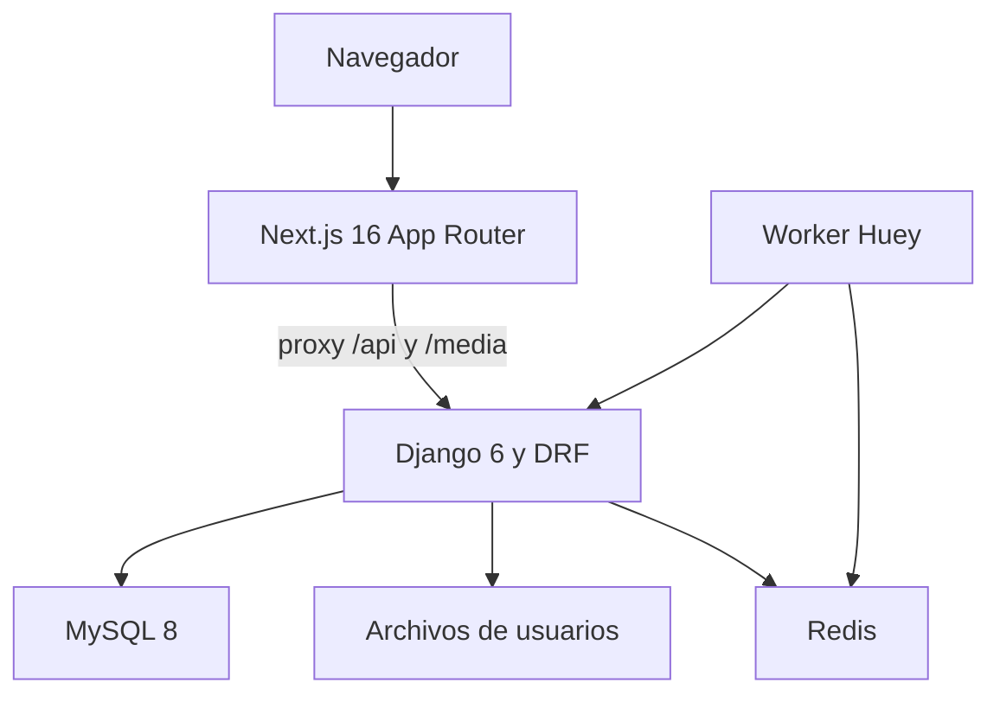
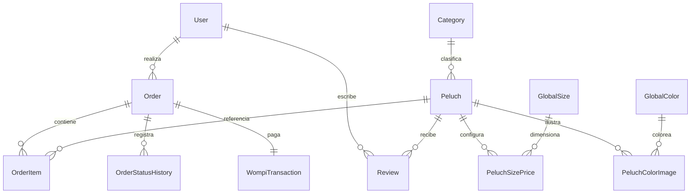

# Arquitectura — Mimittos

Revisión: 2026-09-25.

## Componentes del sistema


```mermaid
graph TD
    Browser[Navegador] --> NextJS[Next.js 16 App Router]
    NextJS -->|proxy /api y /media| Django[Django 6 y DRF]
    Django --> MySQL[MySQL 8]
    Django --> Media[Archivos de usuarios]
    Django --> Redis[Redis]
    Huey[Worker Huey] --> Django
    Huey --> Redis
```

Next.js y Django son procesos separados. `frontend/next.config.ts` define los
rewrites de desarrollo/API; `backend/base_feature_project/urls.py` publica API,
admin y rutas condicionales de media/Silk. No existe una vista catch-all para
servir HTML de Next.js desde Django.

## Backend

```text
backend/
├── base_feature_app/
│   ├── models/                 # Entidades, reexportadas por __init__.py
│   ├── serializers/            # Contratos y validación de entradas
│   ├── views/                  # Vistas funcionales DRF
│   ├── services/               # Lógica por dominio
│   ├── urls/                   # Rutas por dominio
│   ├── management/commands/    # Seeds y datos fake
│   ├── templates/emails/       # Plantilla transaccional compartida
│   ├── utils/                  # Auth, media y render de emails
│   └── tests/
├── django_attachments/         # Library, Attachment y campos de imágenes
├── base_feature_project/
│   ├── settings.py             # Configuración común
│   ├── settings_dev.py         # Desarrollo
│   ├── settings_prod.py        # Producción
│   └── urls.py                 # API, admin y rutas condicionales
└── conftest.py                 # Fixtures pytest
```

La lógica de negocio está en servicios de pedidos, reseñas, pagos, analytics,
media, email y notificaciones. Se conserva la app de dominio única.

### Relaciones principales


```mermaid
erDiagram
    User ||--o{ Order : realiza
    User ||--o{ Review : escribe
    Category ||--o{ Peluch : clasifica
    Peluch ||--o{ PeluchSizePrice : configura
    GlobalSize ||--o{ PeluchSizePrice : dimensiona
    Peluch ||--o{ PeluchColorImage : ilustra
    GlobalColor ||--o{ PeluchColorImage : colorea
    Peluch ||--o{ Review : recibe
    Order ||--o{ OrderItem : contiene
    Peluch ||--o{ OrderItem : referencia
    Order ||--o{ OrderStatusHistory : registra
    Order ||--|| WompiTransaction : paga
```

`OrderItem` conserva una configuración snapshot y referencias opcionales a talla,
color y `PersonalizationMedia`, para preservar el histórico. Precios, anticipos,
descuentos por pago completo y envío se configuran por `PeluchSizePrice`.

`SiteContent` almacena JSON por key. `Blog` tiene título, descripción, categoría e
imagen, sin campos de idioma. Los modelos Product/Sale/SoldProduct y sus endpoints
backend permanecen existentes aunque la tienda actual usa Peluch.

## Frontend

Rutas públicas: inicio, catálogo, `/peluches/[slug]`, carrito, checkout, pago,
confirmación, seguimiento, blog, auth, historia, contacto y términos. `/orders`
requiere sesión y `/backoffice` concentra las vistas administrativas.

Los componentes compartidos viven en `components/admin`, `blog`, `layout` y `ui`.
`PublicChrome` coordina banner, Header y Footer. La portada compone sus secciones
y utiliza Swiper; el catálogo renderiza sus propias tarjetas.

Stores activos: `authStore`, `cartStore` y `blogStore`. Los servicios por dominio
usan `lib/services/http.ts`. No hay selector de idioma ni provider de next-intl.

```text
Página o store
  → servicio del dominio / http.ts
    → API Django
      → serializer + servicio
        → ORM + MySQL
```

El carrito se persiste localmente. La sesión almacena tokens en cookies; el
interceptor HTTP gestiona el refresco y `providers.tsx` restaura el usuario.

## API por dominio

Todas las rutas se montan bajo `/api/`; los módulos de `base_feature_app/urls/`
son la fuente de verdad de métodos y permisos.

| Dominio | Rutas representativas |
|---|---|
| Auth | sign_in, sign_up, google_login, verify_registration, token/refresh |
| Catálogo | categories, sizes, colors, peluches y galerías |
| Pedidos | orders, orders/list, orders/my, orders/track y detalle/status/tracking |
| Pagos | payment/process, payment/status, payment/check, payment/wompi/webhook |
| Reseñas | Listado por peluche y moderación |
| Analytics | Pageviews, KPIs, dashboard y exportación |
| Blog/product/sale/user | Listados y operaciones por entidad |
| Media/content/captcha | Upload, contenido por key y verificación |

Wompi informa el resultado por webhook. El navegador comprueba el estado al
volver del pago; no debe introducirse polling a Wompi.

## Despliegue

Según `vps-ops-toolkit/projects.yml`, Mimittos corre en `vps-projectapp-prod`,
dominio `mimittos.com`, rama `main` y base MySQL `mimittos_project_db`.

| Servicio | Función |
|---|---|
| `mimittos_project` | Gunicorn/Django, socket `/run/mimittos_project.sock` |
| `mimittos-frontend` | Next.js, puerto 3002 |
| `mimittos-huey` | Tareas asíncronas, Redis DB 10 |

El deploy autorizado instala dependencias y construye `.next/`, ejecuta
collectstatic y administra los servicios. El clon principal es su checkout;
las sesiones modifican worktrees propios y no migran su base enlazada.
`scripts/systemd/huey.service` es una plantilla con placeholders, no el inventario
del servicio instalado.

## Pruebas y flujos

Jest verifica páginas, componentes, stores, hooks y servicios. Playwright organiza
specs en `e2e/public`, `app`, `auth` y `backoffice`; CI utiliza dos shards.
`frontend/e2e/flow-definitions.json` conserva el contrato y
`docs/USER_FLOW_MAP.md` lo documenta. Los módulos eliminados en la limpieza de
septiembre no eran alcanzables desde las páginas; no se retiran flujos activos.
